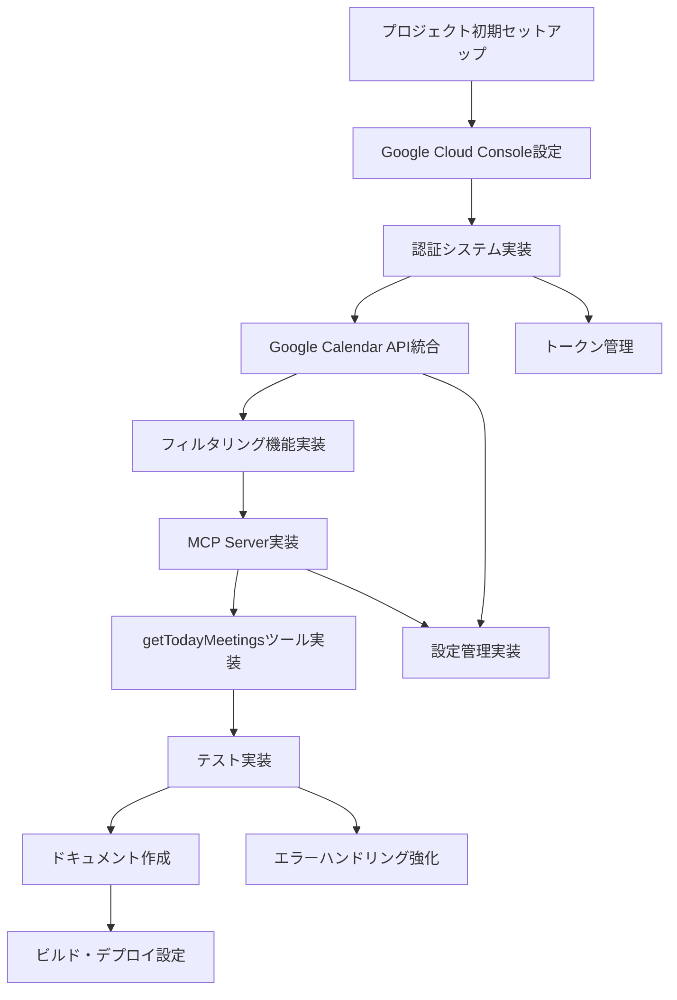

# Google Calendar MCP Server 開発タスクリスト

## 📋 タスク概要
このドキュメントは、Google Calendar MCP Serverの開発に必要なタスクを管理するためのリストです。
各タスクには優先度、依存関係、完了基準が定義されています。

## 🎯 マイルストーン

### Phase 1: 基盤構築（優先度：高）
- [ ] プロジェクト初期セットアップ
- [ ] Google Cloud Console設定
- [ ] OAuth 2.0認証実装
- [ ] トークン管理システム構築

### Phase 2: コア機能実装（優先度：高）
- [ ] Google Calendar APIクライアント実装
- [ ] MCPサーバー基盤実装
- [ ] イベントフィルタリング機能実装
- [ ] getTodayMeetingsツール実装

### Phase 3: 品質保証（優先度：中）
- [ ] 単体テスト実装
- [ ] 統合テスト実装
- [ ] エラーハンドリング強化
- [ ] ドキュメント整備

### Phase 4: 最適化・拡張（優先度：低）
- [ ] パフォーマンス最適化
- [ ] 追加機能の検討・実装

---

## 📝 詳細タスクリスト

### 1. プロジェクト初期セットアップ

#### 1.1 開発環境構築
- [x] Node.js 18以上のインストール確認 ✅ Node.js 22.19.0 (mise)
- [x] TypeScript開発環境のセットアップ ✅
- [x] package.json作成と必要な依存関係のインストール ✅
  - `@modelcontextprotocol/sdk` (1.18.1)
  - `googleapis` (144.0.0)
  - `google-auth-library` (9.14.1)
  - `dotenv` (16.4.7)
  - `typescript` (5.7.2)
  - `tsx` (4.19.2)
  - 開発用依存関係（`@types/node`, `eslint`, `prettier`等）
- [x] tsconfig.json設定 ✅
- [x] .gitignoreファイル作成 ✅
- [x] .env.exampleファイル作成 ✅

#### 1.2 ディレクトリ構造作成
- [x] src/ディレクトリ構造の作成 ✅
  - [x] index.ts作成 ✅
  - [x] auth/ディレクトリ作成 ✅
  - [x] calendar/ディレクトリ作成 ✅
  - [x] tools/ディレクトリ作成 ✅
  - [x] config/ディレクトリ作成 ✅
  - [x] types/ディレクトリ作成 ✅
- [x] tests/ディレクトリ作成 ✅
- [x] dist/ディレクトリ設定（ビルド出力用）✅

### 2. Google Cloud Console設定

#### 2.1 プロジェクト作成・設定
- [ ] Google Cloud Consoleで新規プロジェクト作成
- [ ] Google Calendar APIを有効化
- [ ] OAuth 2.0同意画面の設定
  - [ ] アプリケーション名設定
  - [ ] スコープ設定（calendar.readonly, calendar.events.readonly）
  - [ ] テストユーザーの追加

#### 2.2 OAuth認証情報作成
- [ ] OAuth 2.0クライアントIDの作成
- [ ] リダイレクトURI設定（http://localhost:3000/oauth/callback）
- [ ] クライアントID/シークレットの取得
- [ ] .envファイルへの認証情報設定

### 3. 認証システム実装

#### 3.1 OAuth認証フロー実装（src/auth/oauth.ts）
- [x] 認証URLの生成機能 ✅
  - [x] PKCE実装（code_verifier/code_challenge生成） ✅
  - [x] state生成（CSRF対策） ✅
- [x] ローカルサーバー実装（リダイレクトURI用） ✅
  - [x] HTTPサーバー起動 ✅
  - [x] コールバック処理 ✅
  - [x] 認証コード受信 ✅
- [x] アクセストークン取得処理 ✅
- [x] リフレッシュトークン取得処理 ✅
- [x] トークン自動更新メカニズム ✅

#### 3.2 トークン管理（src/auth/token-manager.ts）
- [x] トークン保存機能 ✅
  - [x] ローカルファイルへの保存 ✅
  - [ ] 暗号化実装（オプション）
- [x] トークン読み込み機能 ✅
- [x] トークン有効性チェック ✅
- [x] トークンリフレッシュ機能 ✅
- [x] トークンファイルパス管理 ✅

### 4. Google Calendar API統合

#### 4.1 APIクライアント実装（src/calendar/client.ts）
- [x] Google Calendar APIクライアント初期化 ✅
- [x] 認証済みクライアントの作成 ✅
- [x] APIリクエスト共通処理 ✅
  - [x] エラーハンドリング ✅
  - [x] リトライロジック ✅
  - [x] レート制限対応 ✅

#### 4.2 イベント取得機能
- [x] カレンダーイベントリスト取得 ✅
  - [x] 日付範囲指定 ✅
  - [x] タイムゾーン処理 ✅
  - [x] ページネーション対応 ✅
- [x] イベント詳細情報取得 ✅
- [x] 参加者情報の取得と解析 ✅

### 5. フィルタリング機能実装

#### 5.1 フィルタリングロジック（src/calendar/filters.ts）
- [x] 参加者数フィルタ実装 ✅
  - [x] 2名以上の参加者チェック ✅
  - [x] 主催者のカウント処理 ✅
- [x] 参加表明フィルタ実装 ✅
  - [x] responseStatusチェック（accepted/tentative） ✅
  - [x] 未回答・欠席の除外 ✅
- [x] キーワード除外フィルタ実装 ✅
  - [x] 設定ファイルからキーワード読み込み ✅
  - [x] タイトル・説明文のキーワードマッチング ✅
  - [x] 大文字小文字の考慮 ✅
- [x] フィルタチェーンの実装 ✅

### 6. MCP Server実装

#### 6.1 サーバー基盤（src/index.ts）
- [x] MCPサーバー初期化 ✅
- [x] stdio transport設定 ✅
- [x] サーバーメタデータ設定 ✅
- [x] ツール登録メカニズム ✅
- [x] エラーハンドリング設定 ✅

#### 6.2 getTodayMeetingsツール実装（src/tools/get-meetings.ts）
- [x] ツール定義 ✅
  - [x] 入力パラメータスキーマ定義 ✅
  - [x] 出力フォーマット定義 ✅
- [x] リクエスト処理実装 ✅
  - [x] パラメータバリデーション ✅
  - [x] カレンダーイベント取得 ✅
  - [x] フィルタリング適用 ✅
  - [x] レスポンス整形 ✅
- [x] エラーハンドリング ✅
  - [x] 認証エラー処理 ✅
  - [x] API制限エラー処理 ✅
  - [x] ネットワークエラー処理 ✅

### 7. 設定管理実装

#### 7.1 設定システム（src/config/settings.ts）
- [x] 環境変数読み込み ✅
- [x] デフォルト値設定 ✅
- [x] 設定値バリデーション ✅
- [ ] 動的設定更新対応

#### 7.2 設定ファイル作成
- [x] .env.example作成（認証情報テンプレート） ✅
- [ ] mcp.json作成（MCP設定）
- [x] 除外キーワード設定ファイル ✅

### 8. 型定義

#### 8.1 TypeScript型定義（src/types/index.ts）
- [x] Google Calendar API型定義 ✅
- [x] MCPツール入出力型定義 ✅
- [x] 内部データ構造型定義 ✅
- [x] 設定型定義 ✅

### 9. テスト実装

#### 9.1 単体テスト
- [ ] 認証フローテスト
  - [ ] トークン取得テスト
  - [ ] トークンリフレッシュテスト
- [ ] フィルタリングロジックテスト
  - [ ] 参加者数フィルタテスト
  - [ ] 参加表明フィルタテスト
  - [ ] キーワード除外テスト
- [ ] 設定管理テスト

#### 9.2 統合テスト
- [ ] Google Calendar API連携テスト
- [ ] MCPサーバー動作テスト
- [ ] エンドツーエンドテスト

#### 9.3 テスト環境設定
- [ ] テストフレームワーク選定・設定（Jest/Vitest等）
- [ ] モック作成
- [ ] テストデータ準備
- [ ] CI/CD設定（GitHub Actions等）

### 10. エラーハンドリング・ロギング

#### 10.1 エラーハンドリング強化
- [ ] カスタムエラークラス作成
- [ ] エラーリカバリー実装
- [ ] ユーザーフレンドリーなエラーメッセージ

#### 10.2 ロギングシステム
- [ ] ロギングライブラリ選定（winston/pino等）
- [ ] ログレベル設定
- [ ] ログファイル管理
- [ ] デバッグモード実装

### 11. ドキュメント作成

#### 11.1 ユーザードキュメント
- [x] README.md作成 ✅
  - [x] インストール手順 ✅
  - [x] 初期設定ガイド ✅
  - [x] 使用方法 ✅
  - [x] トラブルシューティング ✅
- [ ] CONTRIBUTING.md作成
- [x] LICENSE選定・追加 ✅ (MITライセンス)

#### 11.2 技術ドキュメント
- [ ] API仕様書
- [ ] アーキテクチャ図作成
- [ ] シーケンス図作成
- [ ] コードコメント追加

### 12. ビルド・デプロイ設定

#### 12.1 ビルド設定
- [ ] ビルドスクリプト作成
- [ ] 本番用ビルド最適化
- [ ] ソースマップ設定

#### 12.2 パッケージング
- [x] npm scripts設定 ✅
- [ ] 実行可能ファイル作成（オプション）
- [ ] Dockerコンテナ化（オプション）

### 13. パフォーマンス最適化

#### 13.1 キャッシュ実装
- [ ] イベントデータキャッシュ
- [ ] 認証情報キャッシュ
- [ ] キャッシュ無効化ロジック

#### 13.2 最適化
- [ ] API呼び出し最適化
- [ ] バッチ処理実装
- [ ] 非同期処理最適化

### 14. セキュリティ強化

#### 14.1 認証情報保護
- [ ] トークン暗号化実装
- [ ] セキュアストレージ実装
- [ ] 環境変数検証

#### 14.2 セキュリティ監査
- [ ] 依存関係の脆弱性チェック
- [ ] コードセキュリティレビュー
- [ ] OWASP準拠確認

---

## 📊 進捗管理

### 完了基準
各タスクの完了基準：
1. コード実装完了
2. ユニットテスト作成・パス
3. コードレビュー完了
4. ドキュメント更新完了

### 優先度定義
- **高**: コア機能に必要な必須タスク
- **中**: 品質向上に必要なタスク
- **低**: 追加機能・最適化タスク

### 依存関係

---

## 📅 推定スケジュール

### Week 1-2: 基盤構築
- プロジェクトセットアップ
- Google Cloud Console設定
- 基本的な認証フロー実装

### Week 3-4: コア機能開発
- Google Calendar API統合
- フィルタリング機能
- MCP Server基本実装

### Week 5: 品質保証
- テスト実装
- エラーハンドリング
- デバッグ・修正

### Week 6: 完成・リリース準備
- ドキュメント作成
- パフォーマンス最適化
- 最終テスト・リリース

---

## 📝 備考

### リスク管理
1. **Google API制限**: レート制限対策の実装が必要
2. **トークン有効期限**: 6ヶ月ごとの再認証が必要
3. **セキュリティ**: トークンの安全な管理が重要

### 今後の検討事項
- 複数カレンダー対応
- 予定作成・更新機能（書き込み権限）
- Webhook実装（リアルタイム更新）
- 他のカレンダーサービス対応（Outlook等）

### 参考リソース
- [MCP Documentation](https://modelcontextprotocol.io/docs)
- [Google Calendar API Documentation](https://developers.google.com/calendar/api/v3/reference)
- [Google OAuth 2.0 Documentation](https://developers.google.com/identity/protocols/oauth2)